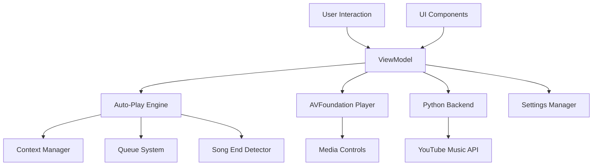
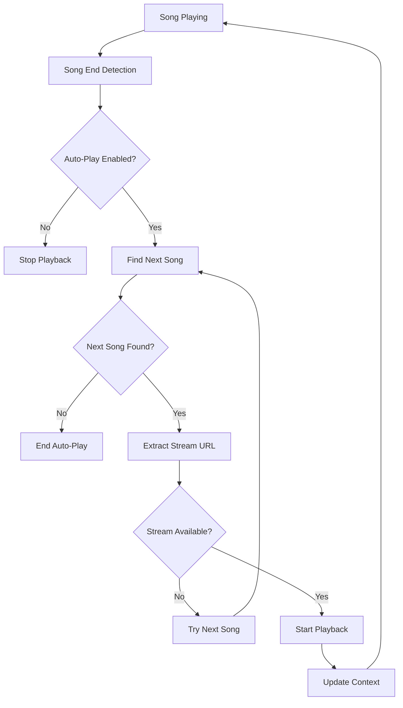
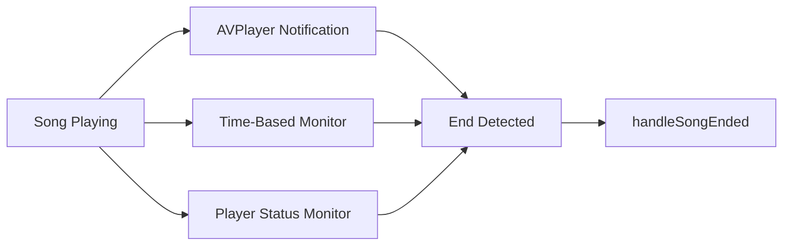
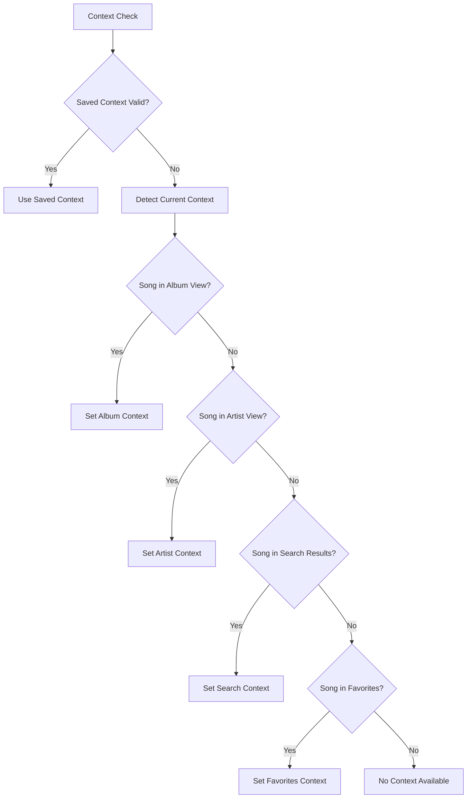

# Auto-Play Next Implementation Design

## Overview

This design document outlines the implementation of robust auto-play next functionality for Spotlight Music, a macOS SwiftUI music player that integrates with YouTube Music. The current implementation has auto-play foundations but lacks key components and reliability mechanisms needed for seamless track progression.

## Current State Analysis

### Existing Auto-Play Infrastructure
- `handleSongEnded()` function triggers when songs complete
- `findNextSong()` algorithm searches across multiple contexts (albums, artists, search, favorites, videos)
- Playlist context tracking with `currentPlaylist`, `currentPlaylistIndex`, and `isPlayingFromPlaylist`
- Settings integration with `autoPlayNext` toggle (enabled by default)
- Song end detection via AVPlayer notifications and time monitoring

### Identified Issues
- Missing `playNextTrack()` and `playPreviousTrack()` function implementations
- Inconsistent playlist context management across different music sources
- Potential reliability issues with song end detection
- No explicit queue management system
- Limited error recovery for failed auto-play attempts

## Architecture

### Core Components



### Auto-Play Flow Architecture



## Enhanced Auto-Play Engine

### 1. Song End Detection System

#### Multi-Layer Detection Strategy


#### Implementation Details
- **Primary Detection**: AVPlayerItemDidPlayToEndTime notification listener
- **Secondary Detection**: Time-based monitoring with 0.5 second threshold
- **Backup Detection**: Player status change monitoring
- **Duplicate Prevention**: Improved flag management with timeout reset mechanism

### 2. Context Management System

#### Context Detection Priority
1. **Saved Playlist Context**: Active playlist with valid index
2. **Album Context**: Currently viewing album songs
3. **Artist Context**: Currently viewing artist songs  
4. **Search Context**: Active search results
5. **Video Context**: Video playlist playback
6. **Favorites Context**: Playing from favorites list

#### Context Validation Algorithm


### 3. Queue Management System

#### Implicit Queue Generation
- **Album Queue**: All songs from current album
- **Artist Queue**: Top songs from current artist
- **Search Queue**: Current search results
- **Favorites Queue**: User's favorite songs
- **Video Queue**: Current video playlist

#### Queue State Management
```swift
// Queue state tracking
struct QueueState {
    let songs: [SongItem]
    let currentIndex: Int
    let context: PlaybackContext
    let source: QueueSource
}

enum PlaybackContext {
    case album(AlbumItem)
    case artist(ArtistItem)
    case search(String)
    case favorites
    case videos
}

enum QueueSource {
    case explicit      // User-created playlist
    case implicit      // Auto-generated from context
    case mixed         // Combination of sources
}
```

## Core Implementation Components

### 1. Missing Function Implementations

#### playNextTrack() Function
```swift
func playNextTrack() {
    print("🎵 Manual next track triggered")
    
    guard let currentSong = nowPlaying else {
        print("❌ No current song for next track")
        return
    }
    
    if let nextSong = findNextSong(for: currentSong) {
        print("✅ Manual next: \(nextSong.title)")
        playNextFoundSong(nextSong, after: currentSong)
    } else {
        print("❌ No next song available")
        // Optional: Show user feedback
    }
}
```

#### playPreviousTrack() Function  
```swift
func playPreviousTrack() {
    print("🎵 Manual previous track triggered")
    
    guard let currentSong = nowPlaying else {
        print("❌ No current song for previous track")
        return
    }
    
    if let previousSong = findPreviousSong(for: currentSong) {
        print("✅ Manual previous: \(previousSong.title)")
        playPreviousFoundSong(previousSong, before: currentSong)
    } else {
        print("❌ No previous song available")
        // Optional: Show user feedback
    }
}
```

### 2. Enhanced Context Management

#### Context Update Mechanism
```swift
private func updatePlaylistContextIfNeeded() {
    guard let nowPlayingSong = nowPlaying else { return }
    
    // Check if current context is still valid
    if isPlayingFromPlaylist && !currentPlaylist.isEmpty {
        if currentPlaylistIndex >= 0 && currentPlaylistIndex < currentPlaylist.count {
            let contextSong = currentPlaylist[currentPlaylistIndex]
            if contextSong.id == nowPlayingSong.id {
                return // Context is still valid
            }
        }
    }
    
    // Context is invalid, re-detect
    detectAndSetPlaylistContext(for: nowPlayingSong)
}
```

### 3. Robust Error Handling

#### Auto-Play Error Recovery
```swift
private func handleAutoPlayError(for song: SongItem, error: String) {
    print("⚠️ Auto-play error for \(song.title): \(error)")
    
    // Try to find the next song and skip the problematic one
    if let nextSong = findNextSong(for: song) {
        print("🔄 Skipping failed song, trying next: \(nextSong.title)")
        playNextFoundSong(nextSong, after: song)
    } else {
        print("❌ No more songs available, stopping auto-play")
        MPNowPlayingInfoCenter.default().playbackState = .stopped
    }
}
```

### 4. Settings Integration Enhancement

#### Real-time Settings Monitoring
```swift
private func observeAutoPlaySettings() {
    NotificationCenter.default.addObserver(
        forName: UserDefaults.didChangeNotification,
        object: nil,
        queue: .main
    ) { [weak self] _ in
        guard let self = self else { return }
        
        // React to auto-play setting changes
        if !SettingsManager.shared.autoPlayNext {
            print("🔇 Auto-play disabled by user")
            // Cancel any pending auto-play
        } else {
            print("🔊 Auto-play enabled by user")
        }
    }
}
```

## Data Models Enhancement

### Enhanced Song Context Tracking
```swift
// Enhanced song item with context information
extension SongItem {
    var playbackContext: PlaybackContext? {
        // Determine the context this song belongs to
    }
    
    var queuePosition: Int? {
        // Position in current queue if applicable
    }
}
```

### Queue Management Models
```swift
struct PlaybackQueue {
    let id: UUID = UUID()
    var songs: [SongItem]
    var currentIndex: Int
    var context: PlaybackContext
    var isShuffled: Bool = false
    var repeatMode: RepeatMode = .none
    
    var currentSong: SongItem? {
        guard currentIndex >= 0 && currentIndex < songs.count else { return nil }
        return songs[currentIndex]
    }
    
    var nextSong: SongItem? {
        let nextIndex = currentIndex + 1
        guard nextIndex < songs.count else { return nil }
        return songs[nextIndex]
    }
    
    var previousSong: SongItem? {
        let prevIndex = currentIndex - 1
        guard prevIndex >= 0 else { return nil }
        return songs[prevIndex]
    }
}

enum RepeatMode {
    case none
    case one
    case all
}
```

## UI Enhancements

### Auto-Play Status Indicators
- Visual feedback when auto-play is active
- Queue position display
- Next song preview
- Auto-play toggle accessibility

### Debug and Testing Tools
- Manual auto-play trigger buttons (development mode)
- Context information display
- Queue state visualization
- Error state indicators

## Integration Points

### Media Controls Integration
- Enhanced `configureRemoteCommandCenter()` with proper next/previous handling
- Improved media key responsiveness
- Better Control Center integration

### Python Backend Integration
- Robust stream URL extraction with multiple fallbacks
- Enhanced error handling for API failures
- Improved caching for better performance

## Error Handling Strategy

### Auto-Play Failure Scenarios
1. **Stream Extraction Failure**: Skip to next song automatically
2. **Network Connectivity Issues**: Retry with exponential backoff
3. **Context Loss**: Re-detect context or graceful degradation
4. **Invalid Queue State**: Rebuild queue from current context

### Recovery Mechanisms
- Automatic retry for transient failures
- Graceful fallback to simpler contexts
- User notification for persistent issues
- Manual recovery options

## Performance Considerations

### Optimization Strategies
- Lazy loading of queue content
- Efficient context detection algorithms
- Minimal UI updates during auto-play transitions
- Background processing for stream preparation

### Memory Management
- Proper cleanup of AVPlayer observers
- Context state cleanup on app termination
- Efficient queue management for large playlists

## Future Enhancements

### Advanced Queue Features
- User-defined playlists
- Queue editing and reordering
- Shuffle and repeat modes
- Cross-session queue persistence

### Smart Auto-Play
- Machine learning for music preference detection
- Context-aware recommendations
- Adaptive queue generation

### Enhanced User Control
- Skip/ban functionality
- Auto-play customization settings
- Queue management UI